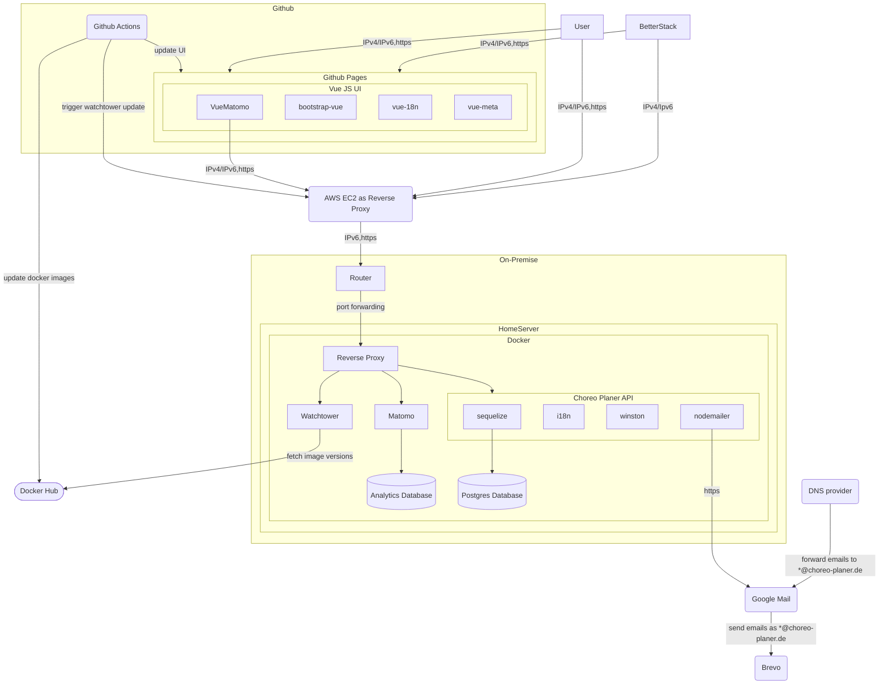

# Choreo Planer

>)

`Planning tool for choreographies in cheerleading and dance`

## :iphone: Socials

## Architecture

## :+1: Collaborators

- [Andreas Nicklaus](https://github.com/andreasnicklaus)     

## :scroll: License

See [LICENSE](LICENSE) for the license of this project.

## :sparkles: Version history

### 0.11.2 - 2025-12-02

- Added ability to control the video length by time rather than BPS
- Added help section for video exports
- Error handling for faulty mp4 video codec
- Error handling for stuck page load
- Increased security by updating dependencies and fixing vulnerabilities

### 0.11.1 - 2025-10-16

- Log ingestion for better observability
- Switched to Typescript and added documentation
- UI Testing: added unit tests and integration test to ensure a acceptable user experience on most common browsers
- Backend Testing: added unit tests to ensure that services are compatible with the implementation of the REST server

### 0.11.0 - 2025-05-09 (alias: 0.10.3)

- New mat variants
  - Square without license
  - Flat rectangle (1:2) for guard dance or similar
  - Boxy rectangle (3:4) for regular theater stages
- Improved on user experience by adding a "last logged in" field to track the last time a user was seen
- Added a "new feature" badge to increase visibility

### 0.10.2 - 2025-05-03

- Added notification service with increased interactivity for users
- Localization of Server Messages and Pages for English :gb: and German :de:

### 0.10.1 - 2025-04-12

- Enhanced user settings on profile page
- SSO for "forgot password" function
- Personalization through profile pictures and club logos

### 0.10.0 - 2025-03-25

- Added internationalization for English and German
- Added security best practices for backend server (security headers, rate limiting)
- Minor UI improvements
- Implemented fuzzy search and created links in admin dashboard

### 0.9.8 - 2025-01-08

- Fixed issues with mobile UI
- Added structured data for improved SEO
- Removed mailproxy and moved mail configuration to backend server

### 0.9.7 - 2025-01-08

- Added icon variants for holiday seasons
- Added server availability status information
- Fixed loading issues for new teams
- Added admin panel for application overview

### 0.9.6 - 2024-12-05

- Added feedback option
- Fixed spelling errors

### 0.9.5 - 2024-11-29

- Improved usability by adding feedback messages for email confirmation and app installation prompt

### 0.9.4 - 2024-11-28

- Support for mobile devices
- Added email address to user profile used for logging in
- Added mailserver configuration for sending emails to admins and users
- Added social links to github and instagram
- Fixed display error of dot size on the choreo mat

### 0.9.3 - 2024-11-16

- Added support for installing the app from the browser
- Added impressum, data protection declaration and open graph meta tags
- Fixed errors on team creation and prerendering

### 0.9.2 - 2024-11-14

- Improved performance by prerendering public pages
- Added Meta tags for improved search engine visibility

### 0.9.1 - 2024-11-12

- Fixed errors on server build
- Added sitemap for search engine visibility

### 0.9.0 - 2024-11-11

- Implemented animations in editing view
- Added video and PDF download option
- Added keyboard shortcuts for quick editing
- Improved account management by adding account page
- Project version is visible in footer
