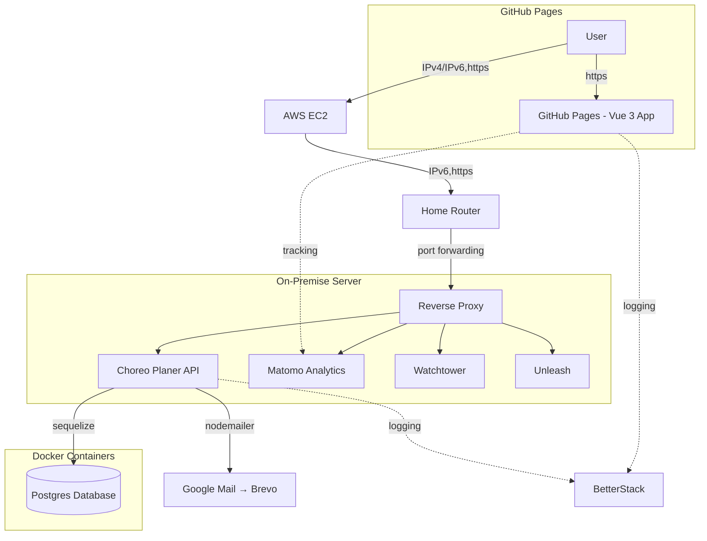

# Choreo Planer

<div align="center">


)


</div>

## Features

- Choreography editor and visualization with mat-based positioning
- Team and routine management
- Video and PDF export with FFmpeg.wasm
- Responsive design (mobile-friendly)
- Internationalization (English & German)
- Feature flags via Unleash
- Integration with backend API
- PWA support (installable)

## Prerequisites

- [Node.js](https://nodejs.org/) (v18 or newer recommended)
- [npm](https://www.npmjs.com/)

## Quick Start

1. Install dependencies:
   ```sh
   npm install
   ```
2. Start the development server:
   ```sh
   npm run dev
   ```
   The app will be available at the configured localhost port by default.

## Useful npm scripts

| Script                 | Description                                                             |
| ---------------------- | ----------------------------------------------------------------------- |
| `npm run dev`          | Start the development server with hot reload (includes icon generation) |
| `npm run build`        | Build for production (includes docs, icons, prerendering, sitemap)      |
| `npm run preview`      | Preview the production build locally                                    |
| `npm run lint`         | Run ESLint with strict rules                                            |
| `npm run lint:fix`     | Run ESLint with auto-fix                                                |
| `npm run test`         | Run all tests (unit + E2E)                                              |
| `npm run test:unit`    | Run Vitest unit tests                                                   |
| `npm run test:e2e`     | Run Playwright E2E tests                                                |
| `npm run test:e2e:ui`  | Run Playwright with UI                                                  |
| `npm run docs`         | Generate JSDoc documentation                                            |
| `npm run docs:watch`   | Live-reload documentation server                                        |
| `npm run format`       | Format code with Prettier                                               |
| `npm run format:check` | Check code formatting                                                   |

## Project Structure

```
app/
├── public/              # Static assets (icons, docs)
├── src/
│   ├── components/      # Vue components
│   ├── docsDef.js      # Documentation definitions
│   ├── i18n/           # Translation files (en.json, de.json)
│   ├── plugins/        # Vue plugin configurations
│   ├── router/        # Vue Router configuration
│   ├── services/      # API service layer
│   ├── store/          # Vuex store
│   ├── utils/          # Utility functions
│   ├── views/          # Page components
│   ├── App.vue         # Root component
│   └── main.js         # Entry point
├── tests/
│   ├── integration/    # Playwright E2E tests
│   └── unit/           # Vitest unit tests
├── vite.config.js      # Vite configuration
└── package.json
```

## Architecture



## Testing

### Unit Tests (Vitest)
```sh
npm run test:unit
```

Coverage thresholds are set to 80% for branches, functions, lines, and statements.

### E2E Tests (Playwright)
```sh
npm run test:e2e
```

Tests are run in 7 parallel shards in CI. To run locally with UI:
```sh
npm run test:e2e:ui
```

## License

See [LICENSE](../LICENSE) for details.

## Support

For questions or support, please open an issue or contact the maintainer via the website.

---

© <span id="year"></span> Andreas Nicklaus. Licensed under the MIT License.

<script>
    document.getElementById("year").textContent = new Date().getFullYear();
</script>
<script type="module">
  import mermaid from 'https://cdn.jsdelivr.net/npm/mermaid@11/dist/mermaid.esm.min.mjs';
</script>
