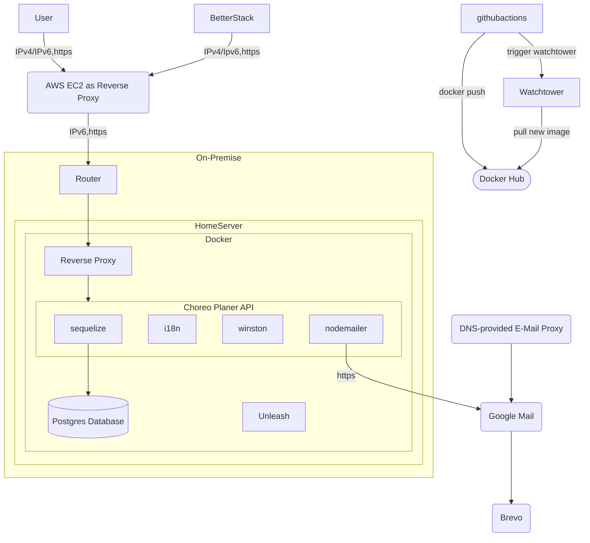

<h1>Choreo Planer API</h1>

<div align="center">


</div>

---

## Features

- User authentication & JWT management
- Soft-delete user accounts with recovery
- Routine and element management (choreos, hits, lineups, positions)
- Team collaboration tools
- Club and season management
- Notification system
- Feedback collection
- Contact form with email notifications
- RESTful API with OpenAPI/Swagger documentation
- Dockerized deployment with automatic updates via Watchtower

## Quick Start

### Prerequisites

- [Docker](https://www.docker.com/)
- [Docker Compose](https://docs.docker.com/compose/)

This documentation provides quick start instructions for Docker because the server is designed to run in a Docker container.

### Environment Setup

1. Rename each `.env.template` file to `.env`:
   - `.env.template` → `.env`
   - `.server.env.template` → `.server.env`
2. Fill in the required environment variables in each `.env` file. The `.env` files are located in the following directories:
   - Root directory: `.env` (database config)
   - Root directory: `.server.env` (server config)
   - Optional: `.backup.env` (backup config)

### Running the Server

#### Production

```bash
docker-compose up -d
```

The server will be available at the configured port by default.

#### Development

```bash
docker-compose -f docker-compose.yml -f dev.docker-compose.yml up -d
```

This starts Docker Compose with the development configuration which enables hot reloading.

### Useful npm scripts

| Script              | Description                                            |
| ------------------- | ------------------------------------------------------ |
| `npm run dev`       | Start with nodemon for hot reload (TypeScript via tsx) |
| `npm run start`     | Start the production build                             |
| `npm run build`     | Compile TypeScript and build                           |
| `npm run test`      | Run all tests (lint + unit)                            |
| `npm run test:unit` | Run Jest unit tests                                    |
| `npm run lint`      | Run ESLint                                             |
| `npm run docs`      | Generate JSDoc documentation                           |
| `npm run format`    | Format code with Prettier                              |

## Project Structure

```
server/
├── src/
│   ├── db/
│   │   ├── models/        # Sequelize models
│   │   ├── db.ts          # Database connection
│   │   ├── index.ts      # Model associations
│   │   └── seed.ts       # Database seeding
│   ├── middlewares/      # Express middleware
│   │   ├── errorHandlingMiddleware.ts
│   │   ├── loggingMiddleware.ts
│   │   ├── rateLimitMiddleware.ts
│   │   └── requestQueue.ts
│   ├── plugins/          # Plugin configurations
│   │   ├── i18n.ts       # Internationalization
│   │   ├── nodemailer.ts # Email setup
│   │   └── winston.ts    # Logging setup
│   ├── routes/           # API route handlers
│   │   ├── admin/        # Admin endpoints
│   │   └── *.ts          # REST endpoints
│   ├── services/         # Business logic
│   ├── utils/            # Utility functions
│   ├── views/            # EJS templates
│   │   ├── admin/        # Admin dashboard
│   │   └── mail/         # Email templates
│   └── index.ts          # Entry point
├── tests/
│   └── unit/             # Jest unit tests
├── Dockerfile
├── package.json
└── tsconfig.json
```

## Architecture



## API Documentation

Once the server is running:

- Swagger UI: `/api-docs`
- JSDoc: `/docs`
- Status: `/status`

## Testing

```bash
npm run test
```

This runs ESLint first, then executes Jest unit tests.

## Support

For questions or support, please open an issue or contact the maintainer via the website.

---

© <span id="year"></span> Andreas Nicklaus. Licensed under the MIT License.

<script>
    document.getElementById("year").textContent = new Date().getFullYear();
</script>
<script type="module">
  import mermaid from 'https://cdn.jsdelivr.net/npm/mermaid@11/dist/mermaid.esm.min.mjs';
</script>
